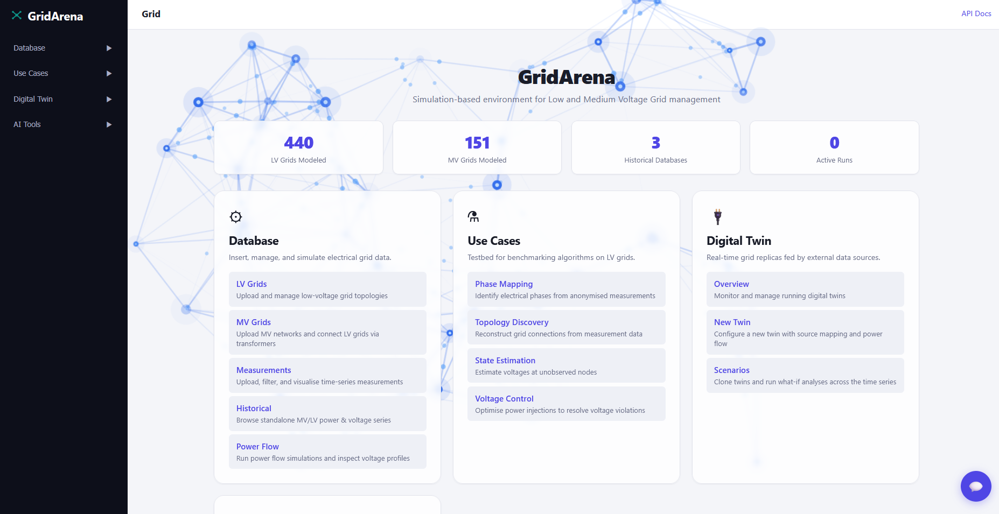

# Low Voltage Grid Play

Digital environment to interact with Low Voltage Grids, supporting grid management, measurement and historical data handling, power flow simulation, and benchmark-based validation of algorithms for phase mapping, topology discovery, state estimation, and voltage control.



---

## 1. Project Status
- **Current state:** Part of the AIEffect project
- **Version:** 0.1
- **Release date:** TBD
- **Maintenance status:** In Development

---

## 2. Technology Stack

List of the main technologies used in the project:

- **Language(s):** Python
- **Framework(s):** FastAPI
- **Database:** PostgreSQL
- **Tools / Libraries:** See `requirements.txt`
- **Cloud / Infrastructure:** No cloud integration

---

## 3. Dependencies

### System dependencies
- Python 3.11
- PostgreSQL server

### Library dependencies
- Install project dependencies with:

```bash
pip install -r requirements.txt
```

### Optional dependencies
- `pytest`
- `uvicorn[standard]`

---

## 4. Installation

### Prerequisites
Before installing the project, make sure the following are available in your environment:

- Python 3.11
- PostgreSQL installed and running
- Access to a configured database for the application

### Steps

```bash
# Clone the repository
git clone <repository_url>
cd <repository_folder>

# Create a virtual environment
python -m venv .venv

# Activate the virtual environment
# Linux / macOS
source .venv/bin/activate

# Windows
.venv\Scripts\activate

# Install dependencies
pip install -r requirements.txt

# Set up environment variables
cp .env.example .env
# edit .env with your database connection string and other settings
```

See [`docs/getting-started.md`](docs/getting-started.md#configuration) for
the full list of environment variables.

---

## 5. Usage

This project provides both API endpoints and browser-based UI pages to interact with low-voltage grid datasets and benchmark workflows.

### Run the application

```bash
uvicorn gridarena.app:app --reload
```

After starting the server, the application is typically available at:

```text
http://127.0.0.1:8000/
```

### Example usage
Once the server is running, you can:

- Open the home page and navigate through the available modules
- Upload grid definitions
- Upload and inspect measurements
- Browse standalone historical power/voltage series
- Run power flow simulations
- Download benchmark datasets
- Submit benchmark results
- Check benchmark scores

### Main UI areas
- **Grid**: manage and inspect grid definitions
- **Measurements**: upload and visualise node/grid-scoped time-series measurements
- **Historical**: browse standalone power/voltage series tagged MV or LV, not tied to any grid or node
- **Power Flow**: run and inspect power flow results
- **Benchmarks**:
  - Phase Mapping
  - Topology Discovery
  - State Estimation
  - Voltage Control

### Tutorials
Add links to tutorials here when available.

---

## 6. Architecture Diagrams

- [`docs/diagrams/component-diagram.md`](docs/diagrams/component-diagram.md) — overall system architecture: routers, database layer, background job workers, digital twin, and LLM chat subsystems.
- [`docs/diagrams/benchmark-sequence-diagram.md`](docs/diagrams/benchmark-sequence-diagram.md) — request flow shared by the four benchmark modules, from anonymised data download through scoring.

---

## 7. Main Functionalities

### Grid Management
- Upload grid definitions from JSON
- List available grids
- Inspect grid tables and graph visualisations
- Delete existing grids

### Measurements
- Upload node/grid-scoped measurement datasets
- Filter measurements by grid, phase, and time interval
- Delete measurements
- Visualise active power and voltage magnitude

### Historical
- Upload standalone power-only, voltage-only, or power+voltage series, tagged MV or LV
- No grid or node assignment required — each series just has its own ID
- Filter records by phase and time interval
- Delete records from a series (the series registration itself is kept)

### Power Flow
- Execute power flow for a selected grid and phase
- Store computed results
- Inspect voltage magnitude and angle over time

### Benchmarks
- Download training and testing data
- Submit algorithm outputs
- Score benchmark results

#### Supported benchmark modules
- Phase Mapping
- Topology Discovery
- State Estimation
- Voltage Control

### Chat Assistant
- Tool-using WebSocket assistant that queries grids, measurements, and benchmarks, and runs
  power-flow/benchmark operations on request
- Retrieval-augmented from the built-in agent documentation
- **Document assistants** *(optional, `LVGPLAY_ALLOW_DOCUMENT_AGENTS=1`)* — user-created,
  read-only knowledge bases built from uploaded Markdown files, answered in their own
  chat surface with every claim cited to its source file and section. See
  [docs/api/chat.md](docs/api/chat.md).

---

## 8. License

This project is licensed under the European Union Public Licence v1.2 (EUPL-1.2), with a
commercial license also available -- see [LICENSE](LICENSE) for details.

---

## 9. Documentation and Resources

- **Full project documentation:** see [`docs/`](docs/index.md) — architecture,
  data model, and a full API reference per router. Built with
  [MkDocs](https://www.mkdocs.org/) and set up to publish on
  [Read the Docs](https://readthedocs.org/) (`.readthedocs.yaml` at the repo
  root); to read it locally, run `pip install -r docs/requirements.txt &&
  mkdocs serve` and open `http://127.0.0.1:8000/`.
- **API reference:** Swagger UI available at:

```text
http://127.0.0.1:8000/docs
```

Additional useful resources:
- [`tutorials/`](tutorials/) — Jupyter notebooks walking through the benchmarks and other workflows
- [`docs/database-schema.md`](docs/database-schema.md) — database setup / table reference

---

## 10. Credits and Acknowledgments

### Contributors
- David Lima
- Gonçalo Cunha
- Gil Sampaio

### Partners or organizations
- INESC TEC

### Acknowledgments


This project is developed as part of the **AI-EFFECT** project. We thank AI-EFFECT for supporting this work.

---

## 11. Contacts

- **Maintainer:** David Lima
- **Email:** david.lima@inesctec.pt
- **Organization:** INESC TEC
- **Security issues:** please report privately per [SECURITY.md](.github/SECURITY.md) rather than opening a public issue.

---

## 12. Contributing

- **Contribution guidelines:** see [CONTRIBUTING.md](.github/CONTRIBUTING.md)
- **Code of Conduct:** see [CODE_OF_CONDUCT.md](.github/CODE_OF_CONDUCT.md)
