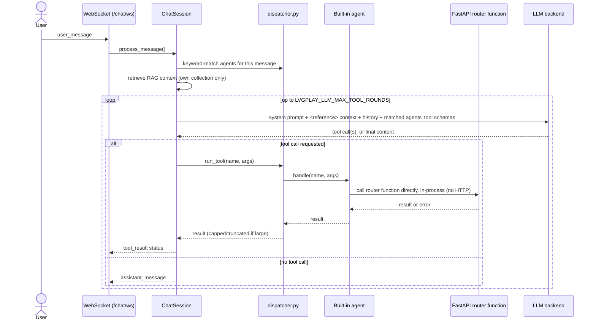

# Architecture

gridarena is a single [FastAPI](https://fastapi.tiangolo.com/) application
(`gridarena/app.py`) composed of independent routers, a shared PostgreSQL
database layer, and a handful of background subsystems (benchmark noise
generation, background job managers, digital twins, and an LLM chat
assistant). It serves both a JSON API and a server-rendered browser UI from
the same process.

```text
gridarena/
├── app.py            # FastAPI app factory, lifespan, router registration
├── routers/           # One module per functional area (grid, mv_grid, ...)
├── schemas/            # Pydantic request/response models
├── database/           # Connection pooling + per-domain table/CRUD helpers
├── benchmarks/         # Data-preparation + scoring logic for the 4 benchmarks
├── powerflow/           # Backward/forward-sweep power flow solver
├── digital_twin/         # Digital twin runner, broker, field mapping
├── diffusion/             # Diffusion-model training pipeline
├── pf_datagen/             # Bulk power-flow scenario generation pipeline
├── rl/                      # Reinforcement-learning environments & training
├── llm/                      # Chat assistant + RAG
├── templates/, static/        # Jinja2 UI (server-rendered)
└── test/                       # Test fixtures used by the top-level tests/
```

## Request lifecycle

1. `gridarena/app.py` builds the `FastAPI` instance and registers 15 routers,
   each mounted under its own path prefix and OpenAPI tag (see
   [API Reference](api/index.md) for the full list).
2. An `asynccontextmanager` `lifespan` hook runs once at process startup:
   it ensures the benchmark-related tables exist (`_ensure_benchmark_tables`),
   initializes the RAG index for chat, and starts the RL/diffusion/PF-datagen
   background job registries. On shutdown it stops the digital twin runners,
   the job registries, and closes the database connection pool.
3. Each request handler gets its own connection via
   `gridarena.database.get_db_connection()`, does its work, and returns the
   connection with `conn.close()` (which — see below — doesn't actually close
   the socket).
4. `CORSMiddleware` is the only global middleware; allowed origins come from
   `CORS_ORIGINS` (see [Getting Started](getting-started.md#optional)).

## Database layer

All PostgreSQL access goes through `gridarena/database/database_connection.py`,
which lazily creates one `psycopg_pool.ConnectionPool` **per OS process** the
first time it's needed. This matters because RL/diffusion/PF-datagen jobs run
in separate worker processes via `ProcessPoolExecutor` — each spawned worker
gets its own independent pool on first use, since a pool created in the main
API process can't be shared across a process-spawn boundary.

To keep every existing call site's `conn.close()` working unchanged while
still pooling connections, connections are handed out as a `_PooledConnection`
subclass whose `close()` returns the connection to the pool instead of
tearing down the socket.

Outside of this shared connection layer, the rest of `gridarena/database/` is
organized per domain, typically as a `create_*_database.py` (idempotent
`CREATE TABLE IF NOT EXISTS` DDL) plus an `insert_*_database.py` / `*_crud.py`
module (parameterized queries only — no string-built SQL). A small
`exceptions.py` defines `NotFoundError`, used by routers to distinguish a
genuine 404 from an unexpected 500.

See [Data Model](database-schema.md) for the actual tables.

## Background job subsystems

Three functional areas — [Reinforcement Learning](api/rl.md),
[Diffusion Models](api/diffusion.md), and [PF Data Generation](api/pf-datagen.md)
— run long jobs in a `ProcessPoolExecutor`-backed run manager (`run_manager.py`
in each package). Submitting a job returns immediately with a `run_id`; job
status (`queued` → `running` → `completed`/`failed`) is tracked in-memory and
persisted to a per-run directory (`runs/<run_id>/`) so it survives an API
process restart. On application shutdown, any still-alive worker process is
forcibly terminated rather than left orphaned.

## Digital Twin

A **Digital Twin** (`gridarena/digital_twin/`) binds one registered LV grid to a
live external data source and runs a periodic background loop: fetch → map →
publish → consume → power-flow → compare. `runner.py` drives this loop per
twin; `broker.py` publishes/consumes measurement batches through Redis;
`connector.py` handles authenticated HTTP calls to the external data source
(with the credential resolved from an environment variable named by the
twin's own `secret_ref`, never stored in the database); `field_mapper.py`
maps external payload fields onto grid nodes/phases; `comparison.py` compares
the twin's power-flow output against observed data. A separate
`scenario_runner.py` drives *offline* (replay-based) scenarios instead of a
live feed — see [Offline Scenarios](api/offline-scenarios.md).

## Benchmarks

`gridarena/benchmarks/` holds the data-preparation and scoring logic behind the
four benchmark routers (Phase Identification, Topology Discovery, State
Estimation, Voltage Control), plus a shared `general_noise/` module used by
all four to apply a platform-controlled, seeded corruption profile
(`clean`/`easy`/`medium`/`hard`) to measurement values before they're handed
to a benchmark participant — see [API Reference › Overview](api/index.md#difficulty-and-noise-profiles)
for the exact profile values.

## LLM Chat

`gridarena/llm/` implements two independent chat sessions, sharing the LLM backend
connection settings (`config.py`, see [Getting Started](getting-started.md#optional)) and
retrieval infrastructure (a Chroma vector store) but nothing else:

- **`ChatSession`** (`chat.py`) — the tool-using grid assistant. `dispatcher.py` keyword-
  matches a message to one or more of the eight built-in agents (`agents/`); each agent's
  `handle()` calls the relevant router function **directly, in-process** (not over HTTP —
  no route-level dependency applies to this path). A turn is a loop of up to
  `LVGPLAY_LLM_MAX_TOOL_ROUNDS` rounds: call the model with only the matched agents' tool
  schemas → if it requests tool calls, execute them and loop; otherwise return its content.
  Retrieved RAG context (from `gridarena/llm/docs/*.md`, chunked and embedded by
  `rag/embedder.py`) is injected as a delimited `<reference>` user message, never into the
  system prompt.
- **`DocumentChatSession`** (`document_chat.py`) — a document assistant (behind
  `LVGPLAY_ALLOW_DOCUMENT_AGENTS`, see [Chat](api/chat.md#document-assistants)). Not a
  subclass of `ChatSession` and has no access to `ALL_TOOLS` at all — the separation from
  the grid assistant is structural, not a runtime filter. It always calls the model with no
  tools, retrieves only from its own agent's Chroma collection (`documents/retrieval.py`),
  and returns citations resolved from the retrieved excerpts' metadata.

Retrieval for both is backed by a Chroma vector store, rebuilt selectively at startup based
on a content-hash manifest (`rag/chroma_db/manifest.json`) — only a doc whose content,
chunker version, or embedding model actually changed is re-embedded.

### How a grid-assistant turn works



A document-assistant turn (`WS /chat/agents/{agent_id}/ws`) is simpler and has no loop: it
retrieves from its own collection, makes exactly one no-tools LLM call, and returns the
answer with citations resolved from the retrieved excerpts.

## UI

Every router that has a corresponding browser page also serves it from the
same FastAPI process, under `<prefix>/ui` (Jinja2 templates in
`gridarena/templates/`, styled by `gridarena/static/css/`, scripted by
`gridarena/static/js/`). These UI routes return HTML and are excluded from the
OpenAPI schema; the [API Reference](api/index.md) documents the JSON API only.
