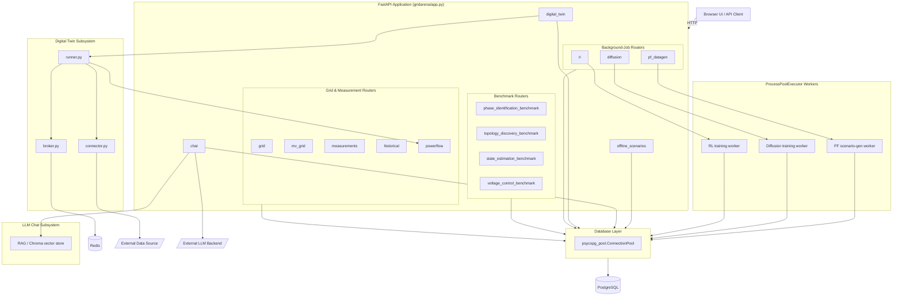

# Component Diagram

High-level view of gridarena's runtime components: the FastAPI application and
its routers, the shared database layer, the background job workers, the
digital twin subsystem, and the LLM chat subsystem. See [Architecture](../architecture.md)
for the accompanying prose description.

